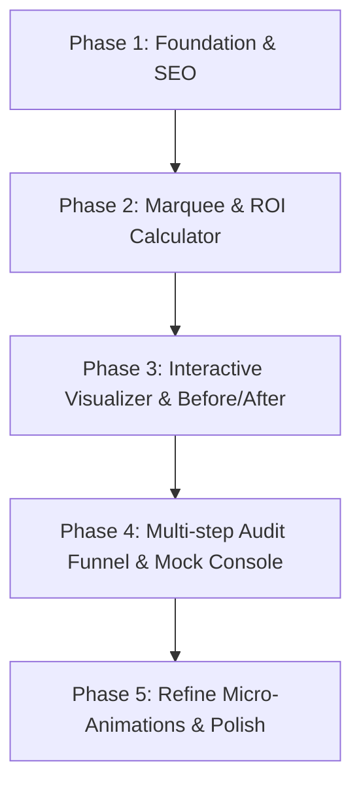

# Implementation Plan - Core Website Improvements

This document outlines a series of premium enhancements to elevate the **Synthesis Automation** Single Page Application (SPA). These features go beyond standard visual adjustments to deliver a highly interactive, high-converting, and premium user experience that showcases the actual value of custom AI operations.

---

## Proposed Improvements & Checklist

### 1. Interactive ROI / Automation Savings Calculator
*Create a highly engaging, slider-based financial calculator that lets visitors see the concrete economic value of operational automation.*

- [ ] **Interactive Sliders**:
  - **Manual Tasks Duration**: Slider for estimated weekly hours spent on manual work (e.g., 5 to 100 hours).
  - **Employee Labor Cost**: Slider for average hourly labor cost (e.g., $15 to $150/hr).
  - **Human Error & Rework Factor**: Dropdown or slider representing manual error frequency/impact (Low, Medium, High).
- [ ] **Real-time Live Counters**:
  - Dynamic display calculating **Monthly Hours Reclaimed**, **Monthly Capital Saved ($)**, and **Projected Annual ROI ($)**.
  - Smooth animation/transition of numbers using Framer Motion when sliders are dragged.
- [ ] **CTA Integration**:
  - Add a "Lock In These Savings" action button at the bottom of the calculator that scrolls the user to the Audit Form and pre-selects/fills in their estimated hours.

---

### 2. Live Tech Stack Integration Showcase (Infinite Marquee)
*Visually demonstrate that Synthesis seamlessly connects with the user's existing tools.*

- [ ] **Dual-Direction Scrolling Marquee**:
  - Two parallel horizontal bands of software integration logos scrolling slowly in opposite directions (left-to-right and right-to-left) to create dynamic depth.
  - Include high-profile platforms: OpenAI, Anthropic, Slack, Salesforce, Google Workspace, Stripe, Airtable, HubSpot, Zapier, Shopify.
- [ ] **Premium Hover & Glow Styles**:
  - Brand-colored spotlight glows behind each icon when hovered.
  - Fully responsive, smooth infinite CSS translation (`transform: translate3d`) for hardware-accelerated 60fps scrolling.

---

### 3. Interactive Workflow Visualizer ("How We Automate")
*A tactile, interactive schematic replacing or augmenting static text to explain automation architecture.*

- [ ] **Use Case Selector Tabs**:
  - Add tabs for common use cases: "Lead Ingest & CRM," "Auto-Invoicing," "Customer Support Triage," and "Document Processing."
- [ ] **Animated Workflow Canvas**:
  - Render an interactive flow map (e.g., **Source** [Webhook] `->` **AI Agent** [OpenAI] `->` **Output** [Slack / Database]).
  - Animate small glowing "data packets" (small spheres or pulses) traveling along SVG path connectors to visualize the flow of data.
- [ ] **Clickable Nodes**:
  - Allow users to click on nodes (e.g. the "AI Classifier" node) to see a tooltip detailing what happens under the hood (e.g., "Extracts metadata, summarizes content, and assigns priority rating").

---

### 4. Interactive Multi-Step Audit Funnel
*Transform the single-field email sign-up into a engaging, multi-step mini-survey that gamifies the audit request and gathers higher-quality leads.*

- [ ] **Multi-Step Survey Flow**:
  - **Step 1: Current Bottlenecks**: Clickable grid cards representing major operations pain points (e.g. "Data Entry," "Messy Spreadsheets," "Delays in Follow-ups," "Siloed SaaS Tools").
  - **Step 2: Integration Target Stack**: Quick selection cards for tools they currently run (Slack, HubSpot, Gmail, etc.).
  - **Step 3: Actionable Capture**: Email input + company name with dynamic submission state.
- [ ] **Polished Transitions**:
  - Animate step transitions using Framer Motion slide-and-fade layouts.
  - Interactive validation and immediate feedback states.
- [ ] **Interactive Lead Console / Mock Console**:
  - When submitting the email, trigger a visual "Terminal / Code Console" animation indicating connection simulation:
    - `[INFO] Parsing stack parameters...`
    - `[SUCCESS] Synthesis API connection initialized.`
    - `[SUCCESS] Engineering blueprint compiled. Check your inbox!`

---

### 5. Interactive "Before & After" Operational Comparison
*A tab-based visual proof showing the stark contrast between manual pipelines and Synthesis automated workflows.*

- [ ] **The Manual Way (Static/Chaotic)**:
  - Visual diagram showing disconnected nodes, red highlighting, alert icons, warning indicators, and a calculated duration label: "Time: 4.5 Hours | Risk: High".
- [ ] **The Synthesis Way (Streamlined/Optimal)**:
  - Sleek, single-line automated sequence with glowing cyan paths, validation checkmarks, and duration label: "Time: 1.8 Seconds | Risk: 0%".
- [ ] **Interactive Toggle**:
  - Let users drag a slider handles or toggle buttons to overlay/wipe the manual view with the automated view.

---

### 6. Premium UI Micro-Animations & Theme Enhancements
*Polish interactions to make the site feel premium, responsive, and tactile.*

- [ ] **Dynamic Cursor Spotlights & Mouse Effects**:
  - Hover states on active cards should subtly tilt the cards based on mouse coordinates (3D parallax hover effect).
  - Add glowing trails or interactive ripple effects to buttons.
- [ ] **Framer Motion Text Staggers**:
  - Wrap primary headlines so characters or words enter with a subtle staggered fade-and-rise transition (`y: [12, 0]`, `opacity: [0, 1]`).
- [ ] **Custom Neon Scrollbar & Selection**:
  - Define custom scrollbar matching the dark background with a cyan/teal glow handle.
  - Override default browser text selection color with a cyan backdrop.

---

### 7. Core SEO & Technical Optimization
*Optimize the site structure, performance, and accessibility for maximum search index performance.*

- [ ] **JSON-LD Schema Markup**:
  - Inject structured data (Service / Local Business schema) to help search engines parse the core business model.
- [ ] **Dynamic Scroll-Title Sync**:
  - Automatically update document title based on the current scroll section (e.g. `Synthesis | Savings Calculator`, `Synthesis | Process Roadmap`).
- [ ] **Semantic Markup Restructure**:
  - Ensure all layout items map to appropriate HTML5 tags (`<nav>`, `<main>`, `<section>`, `<footer>`).
  - Add descriptive aria-labels for icon buttons and custom controls.

---

## Implementation Steps

### Phase 1: Foundation & SEO
- Restructure HTML elements in `index.html` and `src/App.tsx` for semantic structure.
- Add meta descriptions, Open Graph image tags, and JSON-LD schema scripts.

### Phase 2: Integration Marquee & ROI Calculator
- Install any necessary packages (e.g., `lucide-react` handles the icons; no extra libraries required).
- Add the `SavingsCalculator` component with state-driven sliders.
- Add CSS animations for the infinite scroll logo marquee in `index.css`.

### Phase 3: Interactive Visualizer & Before/After
- Code the `WorkflowVisualizer` using SVG paths with `strokeDasharray` and `strokeDashoffset` animations.
- Code the `BeforeAfterToggle` comparison component.

### Phase 4: Multi-Step Audit Funnel
- Refactor the form inside the Hero card into a step-based controller state.
- Design the lead mock console with a timed text-printing effect.

### Phase 5: Micro-Animations & Final Polish
- Introduce Framer Motion staggered reveals to main headers.
- Tune coordinates of the background spotlight and add card 3D tilt effects.
